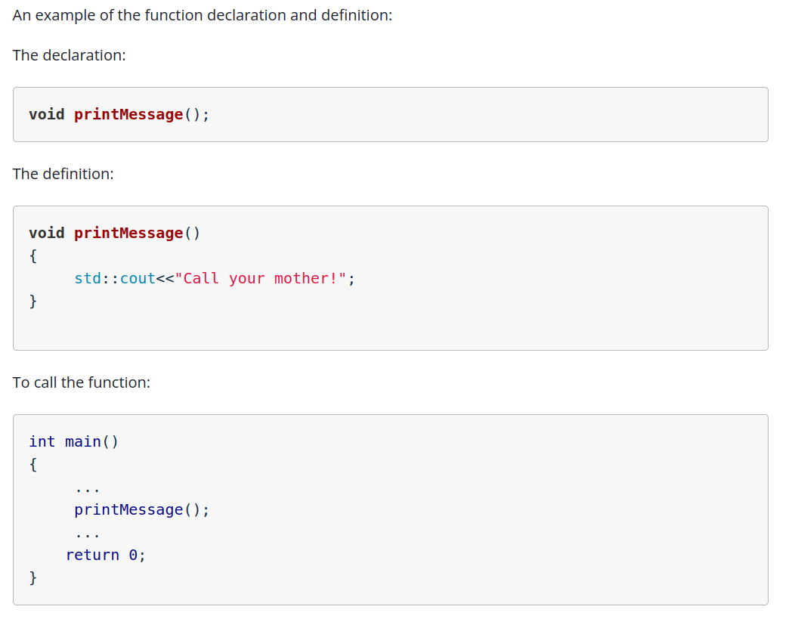
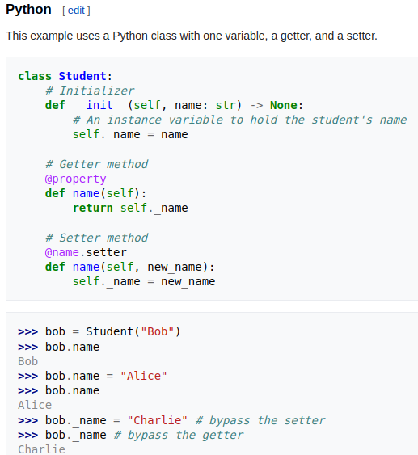
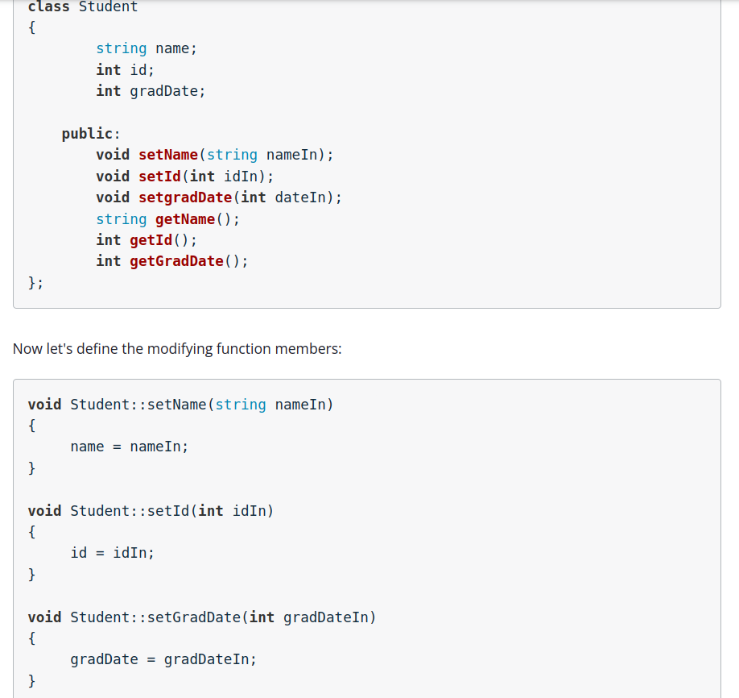
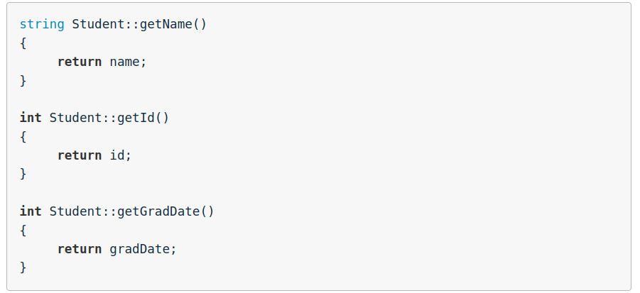
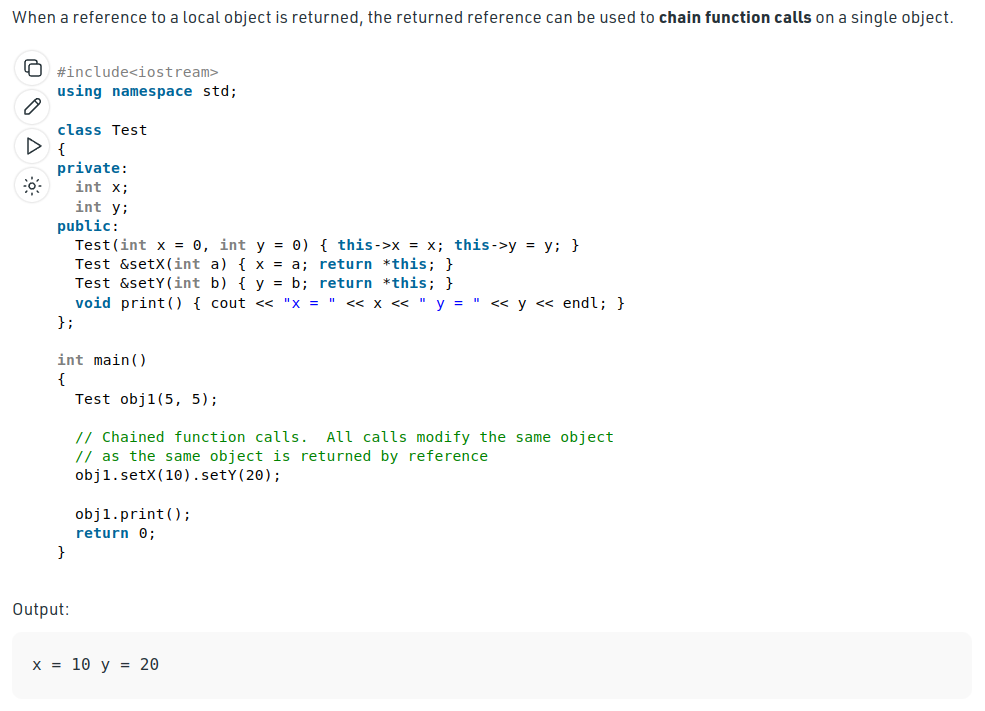

<details open markdown="block">
  <summary>
    Table of contents
  </summary>
  {: .text-delta }
1. TOC
{:toc}
</details>


# Before you Begin



## Convention

```cpp
#include<iostream>

void printMessage(); //note, this is placed BEFORE main()

int main()
{
    printMessage();
    return 0;
}

//note, the definition is conventionally placed after main
void printMessage() 
{
    std::cout<<"HEY! I'm from a function!";
}
```

## Functions in Header Files

This is simlar to how we create a utils file in python. This helps keep the code cleaner

# Variable scope in different functions

## Return altered variable from function

See the below example:
```cpp
#include<iostream>

int increment(int input);
int main()
{
    int a = 34;
    std::cout<<"Before the function call a = "<<a<<"\n";
    a = increment(a);
    std::cout<<"After the function call a = "<<a<<"\n";
    return 0;
}
int increment(int input)
{
    input++;
    std::cout<<"In the function call a = "<<input<<"\n";
    return input;
}
```

**Note. if we just called the 6th line as `increment(a)` then even after function call, the value of `a` would remain as 34. This is because the scope of the variable in the function is not the same as that in the main function**

## Return variable by reference

Here we'll be using pointers to pass only an address
__Note the comments within the code__

```cpp
#include<iostream>

void increment(int &input); //Note the addition of '&'

int main()
{
    int a = 34;
    std::cout<<"Before the function call a = "<<a<<"\n";
    increment(a);
    std::cout<<"After the function call a = "<<a<<"\n";
    return 0;
}
void increment(int &input)//Note the addition of '&'
{
    input++; //**Note the LACK OF THE addition of '&'**
    std::cout<<"In the function call a = "<<input<<"\n";
}
```

**Here by passing the address of the variable**, any changes made will reflect in the main function when that same address is referenced again.


### Case study for call by reference

Understand from the below program how we need to:
- pass pointers only when data modification to that value is required
- a hybrid way of calling by reference and by value is both valid

```cpp
#include <iostream>

int main()
{
    char operation = '*';
    float input1 = 9.8;
    float input2 = 2.3;
    float result;
    
    calculate(input1, input2, operation, result);
    printEquation(input1, input2, operation, result);
    return 0;
}

void calculate(float in1, float in2, char op, float &ans);
void printEquation(float input1,float input2, char operation, float result);

void calculate(float in1, float in2, char op, float &ans)
{
    switch(op)
    {
        case '+': ans = in1 + in2;
                  break;
        case '-': ans = in1 - in2;
                  break;   
        case '*': ans = in1 * in2;
                  break;
        case '/': ans = in1 / in2;
                  break;
        default:  std::cout<<"Illegal operation\n";
    }
}
void printEquation(float input1,float input2, char operation, float result)
{
    std::cout<<input1<<" "<<operation<<" "<<input2<<" = "<<result<<"\n";
}
```

## Best practices for passing variables to functions

When passing variables that are not going to be modified in the function, define the variable as a 'const' so that it cannot be changed by the function.

For example:
```cpp
int doubleInput(const int, input)
{
    int h = input *2;
    return h;
}
```


# Classes

In C++ the class variables are automatically private. We can't call object variables
easily like in python

i.e. for example if we have a class:
```c++
#import<iostream>
using namespace std;

class Trial
{
    string trial_name;
    int trial_number;
};

int main()
{
    Trial trial_first;

    std::cout << trial_first.trial_name;

    return 0;
}
```

We'll get an error:
```
In function ‘int main()’: main.cpp:14:30: error: ‘std::string Trial::trial_name’ is private within this context 14
```

There is a concept called getter/setter in python. In C++ this is called a mutator

**Definition**: Mutators are functions that access/modify data from an external class \
                
                Here, the getter/setters use a python decorator called <@property> and 
                <@var_name.setter> which define which function is to be called either for
                getting a variable or setting the variable (this is why decorators are useful!) 



**C++ Getters and Setters**





## Typical Class functionality

```cpp
#include<iostream>
using namespace std;


class Student
{
        string name;
        int id;
        int gradDate;

    public:
        // setter methods which don't return anything
        // therefore are void types
        void setName(string nameIn);
        void setId(int idIn);
        void setGradDate(int dateIn);
        // getter methods which return a specific datatype
        // Note. they also don't need any inp params
        string getName();
        int getId();
        int getGradDate();
        // print also only outputs from class directly
        // therefore void
        void print();
};

void Student::setName(string nameIn)
{
     name = nameIn;
}

void Student::setId(int idIn)
{
     id = idIn;
}

void Student::setGradDate(int gradDateIn)
{
     gradDate = gradDateIn;
}

void Student::print()
{
     cout<<name<<" "<<id<<" "<<gradDate;
}

string Student::getName()
{
     return name;
}

int Student::getId()
{
     return id; 
}

int Student::getGradDate()
{
     return gradDate;
}

int main()
{
    int integer1; 
    float float1;
    Student student1; 
    
    integer1 = 4; //assign a value to integer1
    float1 = 4.333; //assign a value to float1

    student1.setName("Catherine Gamboa"); //assign a value to the student name
    student1.setId(54345); //assign a value to the student id number
    student1.setGradDate(2017); //assign a value to the student grad date
    
    //Let's print the values of our variables
    cout<<"integer1 = "<<integer1<<"\n";
    cout<<"float1 = "<<float1<<"\n\n";
    
    //There are two ways we can print the values of our class:
    //The first is to call the print function we created.
    cout<<"Using the Student::print function\n";
    cout<<"Student1 = ";
    student1.print();
    cout<<"\n\n";
    
    //The second is to access each member of the class using the get functions
    cout<<"Using the student access functions\n";
    cout<<"Student1 name = "<<student1.getName()<<"\n";
    cout<<"Student1 ID = "<<student1.getId()<<"\n";
    cout<<"Student1 Grad Date = "<<student1.getGradDate()<<"\n";
    
    
    return 0; 
}
```

## Constructors

A constructor is special function that is executed whenever we create a new instance of the class. It is used to set initial values of data members of the class.

**Constructors also do not return any value**

```cpp
/*Goal: learn to use constructors*/


#include<iostream>
using namespace std;

//The cats class that we used earlier in the lesson. 
class Cats
{
    string name;
    string breed; 
    int age;
public:
    Cats(); //declaring the constructor
    void setName(string nameIn);
    void setBreed(string breedIn);
    void setAge(int ageIn);
    string getName();
    string getBreed();
    int getAge();
    void printInfo();
};
//defining the constructor
Cats::Cats()
{
    cout<<"Assigning inital values in the constructor\n";
    name = "Unknown";
    breed = "Unknown"; //the initial value of the breed
    age = 99; //the initial value of the age
}
void Cats::setName(string nameIn)
{
    name = nameIn;
}

void Cats::setBreed(string breedIn)
{
    breed = breedIn;
}

void Cats::setAge(int ageIn)
{
    age = ageIn;
}
string Cats::getName()
{
    return name;
}
string Cats::getBreed()
{
    return breed;
}
int Cats::getAge()
{
    return age;
}
void Cats::printInfo()
{
    cout<<name<<" "<<breed<<" "<<age;
}

//+++++++
int main()
{
    Cats cat1;
    cout<<"Cat1 information: ";
    cat1.printInfo();
    return 0;
}
```

**Note the syntax of a constructor is simple and this is all you need to keep in mind**
```cpp
ClassName::ClassName()
{
     dataMemberName1 = value;
     dataMemberName2 = value;
     ...
}

// the same is in the Cats class as
Cats::Cats()
{
    cout<<"Assigning inital values in the constructor\n";
    name = "Unknown";
    breed = "Unknown"; //the initial value of the breed
    age = 99; //the initial value of the age
}
```

## Destructors
Destructors are special class functions that are called whenever an object goes out of scope. Just like a constructor, a destructor is called automatically.

Destructors cannot:
   - return a value
   - accept parameters

**Destructors must have the same name as the class but the destructor is identified with a tilda (~) symbol**

```cpp
class Dog
{
    private:
        int license;
    public:
        Dog();
        Dog(int licenseIn);
        void setLicense(int licenseIn);
        int getLicense();
        ~Dog();
};

// Constructor
Dog::Dog()
{
   license = 0;
}

//Destructor
Dog::~Dog()
{
    cout<<"\nDeleting the dog";
    // to actually delete the object in memory
    // lookup the memory allocation page
}
```

## Arrays of Classes

See the below example of how to have each element of an array be a class

```cpp
/*main.hpp*/
/*main.hpp*/
/*header file for main.cpp*/
#include<iostream>
using namespace std;

class Student
{
    int grade[5];
    int id;
public:
    Student();
    void setId(int idin);
    void setGrade(int index, int gradeIn);
    int getId();
    int getGrade(int index);
    int getAvg();
    void printInfo();
};

Student::Student()
{
    for(int i=0;i<5;i++)
    {
        grade[i] = 0;
    }
    id = 0;
}

void Student::setId(int idin)
{
    id = idin;
}
void Student::setGrade(int index, int gradeIn)
{
    grade[index] = gradeIn;
}
int  Student::getId()
{
    return id;
}
int  Student::getGrade(int index)
{
    return grade[index];
}
int  Student::getAvg()
{
    int sum = 0;
    for(int i=0; i<5;i++)
        sum = sum + grade[i];
    return sum/5.0;
}
void Student::printInfo()
{
    cout<<id<<"\n";
    for(int i=0; i<5;i++)
        cout<<grade[i]<<" ";
}

int main()
{
    const int SIZE= 3;
    //Create a course of students
    Student course1[SIZE];
    //Each array element is a Student type
    //so it has access to the members of Student
    course1[0].setId(1000);
    course1[1].setId(1111);
    course1[2].setId(2222);

    course1[0].setGrade(0,83);
    course1[1].setGrade(0,95);
    course1[2].setGrade(0,72);

    course1[0].setGrade(1,87);
    course1[1].setGrade(1,52);
    course1[2].setGrade(1,70);

    course1[0].setGrade(2,90);
    course1[1].setGrade(2,85);
    course1[2].setGrade(2,82);
}
```
**Main takeaway is that the declaration for the array of class objects is:**
```cpp
const int SIZE= 3;
Student course1[SIZE];
```

## Tricky Aspects

Now suppose we have a class not visible to us and it's called Dog

However, we use it to create an instance of the class in an array. **This array now becomes of the datatype Dog. Similar to how we say `int courses[3]`**

See how this plays out below:
```cpp
#include<iostream>
#include "Dog.cpp"
using namespace std;

int main()
{
    const int SIZE=3;
    Dog roster[SIZE];

    roster[0].setName("Blue");
    roster[1].setName("King");
    roster[2].setName("Spot");

    printRoster(roster,SIZE);
    return 0;
}

// See here that we declare the roster as of type Dog instead of say: int roster[]
void printRoster(Dog roster[], int size);

void printRoster(Dog roster[], int size)
{
    for(int i=0;i<size;i++)
    {
        roster[i].printInfo();
        cout<<"\n\n";
    }
}
```


## 'this' Pointer

Check out the following link for this pointers [THIS_POINTER](https://www.geeksforgeeks.org/this-pointer-in-c/)

Check out this video for static class varible and understand the difference between memeber functions/variables of a class and static variables of a class. [STATIC_VARS](https://www.youtube.com/watch?v=u8jw0LsQFFg&ab_channel=CppNuts)

### Case 1: Using 'this' to make code more readable

suppose we have the following code:
```cpp
class Point
{
        int x,y;
    public:
        Point(int x1, int y1)
        {
            x = x1;
            y = y1;
        }
};

int main()
{
    Point p1(10,20);
}
```

Now in the constructor there are two types of variables x,y and x1,y1 which feels unncessary and may confuse the code reviewer. To prevent this we can use `this` pointer

```cpp
class Point
{
        int x,y;
    public:
        Point(int x, int y)
        {
            this->x = x;
            this->y = y;
        }
};

int main()
{
    Point p1(10,20);
}
```

**Note. In the above code you may be wondering why the class name and the function name 
are the same. \ 
This is becuase the public function Point is actually a constructor of the class. It will be
called everytime we init the class and provide some arguments. 
See [Overloading Constructors](#overloading-constructors)
section for further information.

### Case 2: To return a reference to the class object and chain calls

- As we learnt, `this` is a reference to each class object applied to non-static variables/member funcs (This is because static vars are common to each class btw, obviously explained in the video above pls watch)

- Also note from the pointers chapter, if `float x = 3;`, then just `x;` would call the variable value
- But `&x` would return the address of x. Therefore `&` is the return type modifier. We see this used below



____________________________________________________________________________________________________________________________________

# Overloading Functions

Assume you have the following scenario:
```cpp
#include<iostream>

int findSmallerInt(int input1, int input2);
float findSmallerFloat(float input1, float input2);

int main()
{
    int a = 5; 
    int b = 4;
    float f1 = 5.43;
    float f2 = 6.32;
    char c1 = 'c';
    char c2 = 'z';
    std::cout<<findSmallerInt(a,b)<<" is the smaller of "<<a<<" and "<<b<<"\n";
    std::cout<<findSmallerFloat(f1,f2)<<" is the smaller of "<<f1<<" and "<<f2<<"\n";
    
    return 0;
}

int findSmallerInt(int input1, int input2)
{
    if(input1<input2)
        return input1;
    return input2;
}
float findSmallerFloat(float input1, float input2)
{
    if(input1<input2)
        return input1;
    return input2;
}
```

Now, in the above code ```findSmallerInt``` and ```findSmallerFloat``` are essentially the
same functions with different variable types. Now, we can use one function to work with both
datatypes instead of using same function name for all using the logic of **Overlaoding**

```cpp
#include<iostream>

//C++ allows us to 'overload' the same function name as long as
//the variable types in the function inputs are different.

class Compare
{
public:
    int findSmaller(int input1, int input2);
    float findSmaller(float input1, float input2);
    char findSmaller(char input1, char input2);

    int findSmaller(int input1, int input2, int input3);
    float findSmaller(float input1, float input2, float input3);
    char findSmaller(char input1, char input2, char input3);

    int findSmaller(int arrayIn[], int size);
    float findSmaller(float arrayIn[], int size);
    char findSmaller(char arrayIn[], int size);
};

int Compare::findSmaller(int input1, int input2)
{
    if(input1<input2)
        return input1;
    return input2;
}
float Compare::findSmaller(float input1, float input2)
{
    if(input1<input2)
        return input1;
    return input2;
}

char Compare::findSmaller(char input1, char input2)
{
    if(input1<input2)
        return input1;
    return input2;
}

int Compare::findSmaller(int input1, int input2, int input3)
{
    if(input1 < input2)
    {
        if(input1 < input3)
            return input1;
        else
            return input3;
    }
    else
    {
        if(input2 < input3)
            return input2;
        else
            return input3;
    }
}

float Compare::findSmaller(float input1, float input2, float input3)
{
    if(input1 < input2)
    {
        if(input1 < input3)
            return input1;
        else
            return input3;
    }
    else
    {
        if(input2 < input3)
            return input2;
        else
            return input3;
    }
}

char Compare::findSmaller(char input1, char input2, char input3)
{
    if(input1 < input2)
    {
        if(input1 < input3)
            return input1;
        else
            return input3;
    }
    else
    {
        if(input2 < input3)
            return input2;
        else
            return input3;
    }
}

int Compare::findSmaller(int arrayIn[], int size)
{
    {
    for (int i = 0; i < size; ++i)
        for (int j = 0; j < size - i - 1; ++j)
         if (arrayIn[j] > arrayIn[j + 1])
        {
          int temp = arrayIn[j];
          arrayIn[j] = arrayIn[j + 1];
          arrayIn[j + 1] = temp;
        }
  }        
    return arrayIn[0];
}

float Compare::findSmaller(float arrayIn[], int size)
{
    {
    for (int i = 0; i < size; ++i)
        for (int j = 0; j < size - i - 1; ++j)
         if (arrayIn[j] > arrayIn[j + 1])
        {
          float temp = arrayIn[j];
          arrayIn[j] = arrayIn[j + 1];
          arrayIn[j + 1] = temp;
        }
  }        
    return arrayIn[0];
}

char Compare::findSmaller(char arrayIn[], int size)
{
    {
    for (int i = 0; i < size; ++i)
        for (int j = 0; j < size - i - 1; ++j)
         if (arrayIn[j] > arrayIn[j + 1])
        {
          int temp = arrayIn[j];
          arrayIn[j] = arrayIn[j + 1];
          arrayIn[j + 1] = temp;
        }
  }        
    return arrayIn[0];
}
```


## Overloading Constructors

Now, it's nice to have a class with different options for constructing the object of the class

We can do the following:

```cpp
//header file for main.hpp

#include<iostream>
#include<string>
using namespace std;

class Square
{
    private:
        int length;
        int width;
    public:
        Square();
        Square(int lenIn, int widIn);
        int getLength();
        int getWidth();
};

Square::Square()
{
    length = 0;
    width = 0;
}

Square::Square(int lenIn, int widIn)
{
    length = lenIn;
    width = widIn;
}

int Square::getLength()
{
    return length;
}

int Square::getWidth()
{
    return width;
}

//______________________________________________________________//
#include "main.hpp"

int main()
{
    Square s1;
    Square s2(4,3);
    cout<<"s1 dimensions are: "<<s1.getWidth()<<","<<s1.getLength();
    cout<<"\ns2 dimensions are: "<<s2.getWidth()<<","<<s2.getLength();
    return 0;
}
```

## Overloading Operators (seems like you'll use this lesser)

header file (.hpp)
```cpp
#include <iostream>

using namespace std;

class Shape 
{
    private:
      int length;     // Length of a box
      int width;

    public:
      // Constructor definition
      Shape(int l = 2, int w = 2) 
      {
         length = l;
         width = w;
      }

      int getWidth()
      {
        return width;
      }

      int getLength()
      {
        return length;
      }

      double Area() 
      {
         return length * width;
      }

      // class function which performs the operator overloading
      int operator +(Shape shapeIn)
      {
          return ((width + shapeIn.getWidth())*(length + shapeIn.getLength()));
      }
};
```

main file(.cpp)
```cpp
int main(void) 
{
   Shape sh1(4, 4);    // Declare shape1
   Shape sh2(2, 6);    // Declare shape2
   Shape sh3;          //Declare shape3
   
   // the operator overloading (we are literally adding two objects of different type)
   int total = sh1 + sh2;
   
   cout << "\nsh1.Area() = " << sh1.Area();
   cout << "\nsh2.Area() = " << sh2.Area();
   cout << "\nTotal = "<<total;
   return 0;
}
```

# Templates

We can make our lives even easier by using templates in in addition to overloading:

```cpp
#include<iostream>

using namespace std;

//Our generic function
template <typename T>  //tell the compiler we are using a template
T findSmaller(T input1,T  input2); 

int main()
{
    int a = 54; 
    int b = 89;
    float f1 = 7.8;
    float f2 = 9.1;
    char c1 = 'f';
    char c2 = 'h';
    string s1 = "Hello";
    string s2 = "Bots are fun";
    
    //Wow! We can use one function for different variable types
    cout<<"\nIntegers compared: "<<findSmaller(a,b);
    cout<<"\nFloats compared: "<<findSmaller(f1,f2);
    cout<<"\nChars compared: "<<findSmaller(c1,c2);
    cout<<"\nStrings compared: "<<findSmaller(s1,s2);   
    return 0;
}

template <typename T>
T findSmaller(T  input1,T  input2)
{
    if(input1 < input2)
        return input1;
    else
        return input2;
}
```

